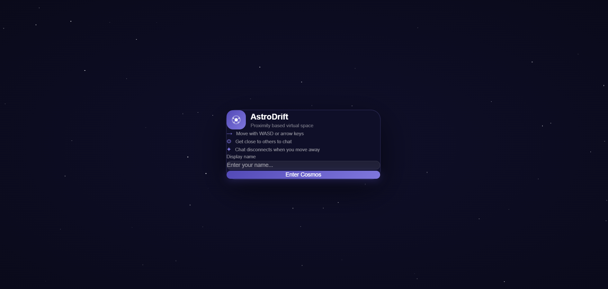
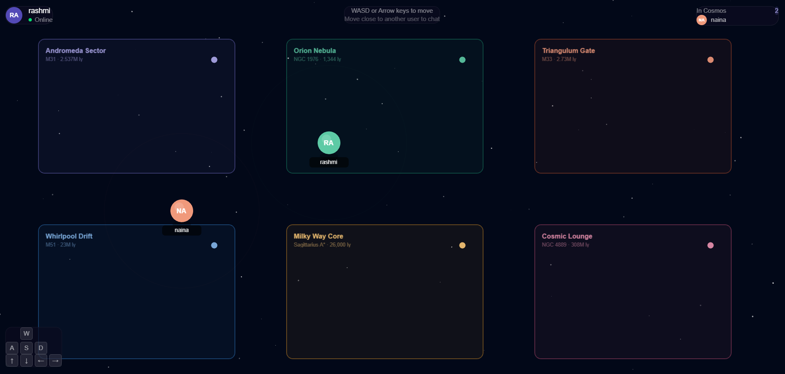
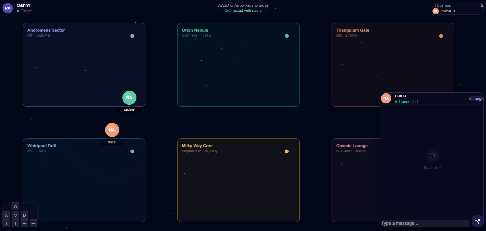
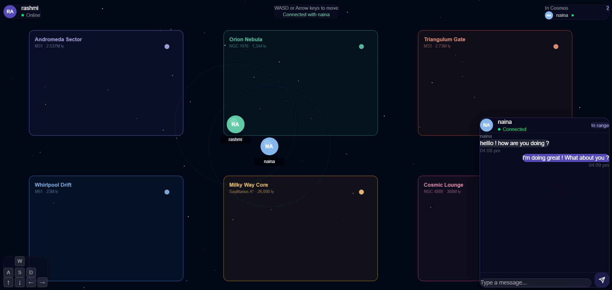

# AstroDrift

> A real time, proximity based chat where users can roam a cosmic canvas and chat only when they are close to each other.






---

## Features

- **Proximity-based chat** — A chat panel opens automatically when two users are within range and close when they are far from each other
- **Real-time multiplayer** — Live avatar movement that is synced across all connected clients
- **PixiJS canvas** — Smooth 2D design with avatars and a cosmic map with named star sectors
- **Typing indicators** — "is typing..." with animated dots when client is typing
- **HUD overlay** — Online users list, connection status, and keyboard reference
- **Colorful avatars** — Each user is assigned a unique color on joining the cosmic world
- **WASD / Arrow key movement** — Smooth movement for avatars

---

## Project Structure

```
AstroDrift/
├── client/                   # React + Vite frontend
│   ├── public/
│   │   ├── favicon.svg
│   │   └── icons.svg
│   └── src/
│       ├── assets/
│       ├── components/
│       │   ├── ChatPanel.jsx     # Proximity chat UI
│       │   ├── GameCanvas.jsx    # PixiJS canvas & avatar rendering
│       │   ├── HUD.jsx           # Heads-up display overlay
│       │   └── LoginScreen.jsx   # Initial screen to enter username
│       ├── hooks/
│       │   ├── useSocket.js      # Socket.IO event management
│       │   └── useKeyboard.js    # Keyboard input tracking
│       ├── App.jsx
│       ├── App.css
│       ├── main.jsx
│       └── index.css
│
└── server/                   # Node.js + Express backend
    ├── models/
    │   └── User.js               # Mongoose user schema
    ├── utils/
    │   └── proximity.js          # Proximity detection logic
    ├── .env                      
    ├── index.js                  # Express + Socket.IO server entry
    └── package.json
```

---

##  Prerequisites

Install the following to run AstroDrift

- [Node.js](https://nodejs.org/) v18 or higher
- [npm](https://www.npmjs.com/) v9 or higher
- [MongoDB](https://www.mongodb.com/) — local instance **or** a [MongoDB Atlas](https://www.mongodb.com/cloud/atlas) connection string

---

##  Setup & Installation

### 1. Clone the repository

```bash
git clone https://github.com/your-username/AstroDrift.git
cd AstroDrift
```

### 2. Set up the Server

```bash
cd server
npm install
```

Create a `.env` file in the `server/` directory:

```env
MONGO_URI=mongodb://localhost:27017/AstroDrift
PORT=3001
```

> **Using MongoDB Atlas?** Replace `MONGO_URI` with your Atlas connection string:
> `mongodb+srv://<username>:<password>@cluster0.xxxxx.mongodb.net/AstroDrift`

### 3. Set up the Client

```bash
cd ../client
npm install
```

---

##  Running AstroDrift

Open **two terminal windows** : one for the server and one for the client

### Terminal 1 : Start the Server

```bash
cd server
node index.js
```

Expected output :
```
🚀 Server running on http://localhost:3001
✅ MongoDB connected

```

### Terminal 2 : Start the Client

```bash
cd client
npm run dev
```

Then open your browser at **[http://localhost:5173](http://localhost:5173)**

---

##  How to Play

1. Enter name (2–20 characters) on the login screen and click **Enter Cosmos**
2. Your avatar appears in the cosmic world as a colored dot and you can simulate movement using WASD or Arrow keys
3. Move close to another avatar to automatically open a private chat
4. Send messages through the chat dialog box opened.
5. Move away to automatically close the chat.
6. The top-right panel shows all users currently in the cosmos


